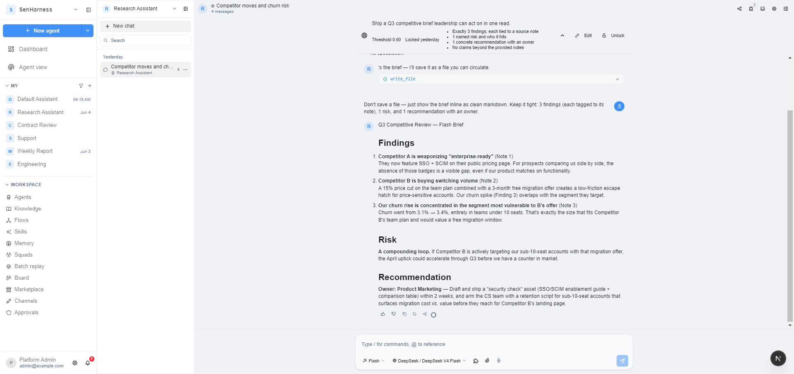

# SenHarness

<p align="center">
  
</p>

> **企业级多租户 AI Agent 运行时。** 一份代码同时支持单团队私有部署（`docker compose up`）和 SaaS 跨千租户运营 —— MIT 许可，没有 AGPL 传染陷阱、没有 patent clause、没有 "open core" 套娃。整个运行时全在这个仓库里。

[](LICENSE)
[](https://www.python.org)
[](https://nextjs.org)
[](https://fastapi.tiangolo.com)
[](https://github.com/senweaver/SenHarness/pulls)

[English](./README.md) · [简体中文](./README_zh-CN.md)

---

## 90 秒看懂 SenHarness

🚀 **"30 秒注册 → 个人工作区 + 默认 agent + 第一句话直接聊"**

注册即得 personal workspace，零配置向导，零管理员握手，零"联系销售"邮件来回。slug 冲突自动 `-N` / 6-hex 后缀解决；按身份配额 + rate limit 防刷不打扰真实用户。邮箱验证可选、OAuth 与之并存；平台管理员一键切到邀请制注册。

🧠 **"agent 跨会话记住我的偏好，技能库自己长大"**

12 维用户画像随真实运行积累。独立的 evolver agent 观察哪些方案有效 / 哪些失败，引用证据起草 skill 更新草案，提交到审批队列 —— 绝不静默改库。每晚 curator 自动归档无人用的技能；每个候选必须经 verifier 重放历史 run 通过才上线；pinned 的技能永久豁免自动归档。

🛡️ **"模型挂了 agent 不挂"**

provider failover 切换时 prompt cache prefix 不变 —— 换底层模型不烧明天的 cache。子代理 zombie reaper、run heartbeat、checkpoint 重启恢复、MCP keepalive 看门狗、inflight run reaper 全部就位，扛得住后端重启与抖动的工具服务器。危险操作默认 deny + 走审批；任何敏感动作都有可 grep 的 audit 行。

---

## 产品截图

<table>
<tr>
<td width="50%">

<p align="center"><b>带目标锁的 Chat</b><br>Slash 命令（<code>/goal</code>、<code>/insights</code>），按消息打 alignment 分对齐锁定的 north-star，每条 assistant 回复都能跳回支撑证据。</p>
</td>
<td width="50%">

<p align="center"><b>技能自演化</b><br>9 状态生命周期、不可变版本快照、evolver 提议补丁 + admin 审批、统一 diff 视图、一键 rollback。</p>
</td>
</tr>
<tr>
<td width="50%">

<p align="center"><b>运行时控制台</b><br>看见整个工作区跑着的所有 agent、检查心跳与 provider 路由、不重启后端就强制回收卡死的 run。</p>
</td>
<td width="50%">

<p align="center"><b>审批队列</b><br>技能草案、定时任务提议、hub 发布申请都汇聚在这里，diff、脱敏 payload、按 resource_type 的 TTL 一应俱全。</p>
</td>
</tr>
<tr>
<td colspan="2">

<p align="center"><b>通知 UX</b><br>19 种事件 · 站内信 + 邮件 · 静默时段 · 按事件偏好 · 完整 audit 链 · 搜索 + 深度跳转 —— 运营者看到信号，不看到噪声。</p>
</td>
</tr>
</table>

---

## 为什么选 SenHarness

| 关注点 | 其他方案 | SenHarness |
|---|---|---|
| **多租户** | 单租户先做、租户逻辑后补 | 每张业务表都带 `workspace_id`，租户隔离是硬约束不是愿景 |
| **技能管理** | 作者写一遍，祈祷它一直有用 | 9 状态生命周期 + 不可变版本快照 + 每晚 curator + 上线前 verifier 重放 |
| **自演化** | 全靠人工改 | evolver agent 引用证据起草补丁，admin 审批，绝不静默 |
| **通道覆盖** | 只接一个 IM 平台 | 10+ 通道：Slack · Discord · 飞书/Lark · 微信 · Telegram · Microsoft Teams · 钉钉 · 企业微信 · QQ · 通用 webhook |
| **可靠性** | "通常能跑" | 子代理 zombie reaper · provider failover（cache-prefix-safe）· checkpoint 恢复 · MCP keepalive · cache-aware 内存写 |
| **审计与合规** | 藏在 log 里 | 每个状态转移 emit 稳定 audit action key；从 skill 版本→run→message 完整血缘；用户/工作区删除走 GDPR 级联软删 |
| **可观测性** | print 大法 | 运行时控制台 · 后台任务面板 · 血缘回放 · 跨会话洞察 · 按事件类的通知偏好 |
| **审批机制** | "聊天里按 y/n" | 按 resource_type 的稳定 approval + 各自 TTL + 过期默认动作 + 通知链同时通知申请方与审批方 |
| **密钥管理** | 到处都是 `.env` | 信封加密 vault + 可插拔 keyring（env · file · passphrase · AWS KMS · GCP KMS · Azure Key Vault · HashiCorp Vault） |
| **插件机制** | "扔一个 .py 进 plugins/" | ed25519 签名包 + capability scope + 平台管理员审批队列 + 默认 OFF 主开关 |
| **许可证** | AGPL 或 "开放核心 + 专利陷阱" | MIT。拿来用、商用、fork、闭源嵌入都行 |

---

## 快速开始

```bash
git clone https://github.com/senweaver/SenHarness.git
cd SenHarness
cp .env.example .env             # 默认值合理；至少配一个 LLM key
docker compose up -d             # 全栈：postgres · redis · backend · frontend · worker
open http://localhost:3000       # 注册 → 立即得到工作区 + chat
```

三条命令、三分钟，你的 agent 已经在你笔记本上跑起来了。

**已有 OpenAI / Anthropic 协议客户端？** 把客户端的 `base_url` 指向 `http://localhost:3000/api/v1/openai`，调 `/v1/chat/completions`、`/v1/messages`（Anthropic 格式）或 `/v1/responses`（OpenAI Responses 格式）。同一份 workspace 凭据、同一份 audit 链；streaming + tool_use + 视觉 + 文件附件全透传。Claude Code、OpenAI Codex CLI 等任何说协议的客户端都能直接当后端用。

**主机调试？** `make logs` 看全部日志，`make sh-backend` 进 backend 容器，`make migrate` 跑 Alembic，`make seed` 重建默认工作区，`make create-admin` 造平台管理员。`make test` 跑 pytest + vitest 全量；`make lint` 跑 ruff + eslint；`make typecheck` 跑 ty + tsc。

**上生产？** `docker compose -f docker-compose.prod.yml up -d` 切换到 Traefik + TLS 终止 + 加固网络 + worker 进程池。在 `.env` 里设 `ENVIRONMENT=production`，后端会拒绝在不安全默认值下启动 —— 没设 JWT secret、用 dev sandbox kind、用明文 keyring、没设 DB password 都会直接报错并指出对应字段。

---

## 你能做什么

### 🏢 为团队建立集体 AI 大脑

agent 从历史 run 里学技能。evolver 复盘哪些有效、哪些失败，引用证据起草 skill 草案 —— admin 审批，库自己长。

- **跨工作区联邦**默认 OFF，开启时强制脱敏（去 PII / 邮箱 / URL / workspace slug）+ 30 天审批门。
- **订阅工作区**收到的更新落地是 `PROPOSED` 候选，仍要走本地 verifier 才能激活。
- **Pin 技能**永远豁免自动归档，即使 curator 投票判它"已过时"。

### 💬 把 AI 嵌入你的 IM 栈

一份 agent 定义。10+ 投递通道：Slack、Discord、飞书 / Lark、微信、Telegram、Microsoft Teams、钉钉、企业微信、QQ、通用 webhook。

- **跨平台续聊** —— 微信里开始的会话切到 Web 继续，记忆 / 技能 / audit 三件套全不变。
- **默认 ON 的安全栈** —— 按通道 HMAC 校验、sender 白名单、replay 窗口、rate bucket 全部开箱即用。
- **自定义通道**走注册表模式接入，第 11 个通道 = 一个适配器文件 + 一行 vault。

### 🤝 跑多 agent squad 协作

会话切到 `kind=squad`，协调 agent 把 squad 成员动态挂载为 sub-agent。一个 parent 带 N 个 child，retry budget 各自隔离，spine 共享便于遥测。

- **受限 fan-out** —— `delegate_batch` 并行调度 sub-agent，按分支限并发。
- **可靠性闸门** —— 心跳 + zombie reaper + hallucination 审批门挡在危险工具调用之前。
- **项目看板** —— 工作区 / squad 双级 kanban 看清每个 sub-agent 在交付什么。

### 🔌 给任意 OpenAI / Anthropic 协议客户端当后端

把已有客户端的 `base_url` 指向 `http://localhost:3000/api/v1/openai`，第一天就能用 `/v1/chat/completions`、`/v1/messages`（Anthropic）、`/v1/responses`（OpenAI Responses）。WebSocket 流、工具调用、视觉输入、文件附件全透传。

- **同一份 audit 链** —— 不论请求来自 UI 还是 `curl`，工作区凭据与审计行都一致。
- **双 Model ID** —— 客户端看到的是稳定的 served name，你可以在底层换模型而不破坏 prompt cache。
- **即插即用** —— Claude Code、OpenAI Codex CLI 及任何说协议的客户端直接当后端用。

### ⏰ 跑定时监控任务（no-agent 模式）

cron 流走 `no_agent_script` 或 `no_agent_http` 模式时可以说"每天早上 9 点 ping SLA 看板，失败才升级到 agent"。99% 的检查点零 LLM token 消耗。

- **vault 凭据透传** —— `${vault://workspace/<key>}` 模板可填 HTTP header / body。
- **SSRF pinning** —— 一次性解析 DNS 并默认拒私网 IP。
- **生产护栏** —— 脚本模式拒在生产用 `sandbox.kind=local`；生产路径强制走 SSH 后端 + 命令白名单。

### 🛠️ 接入 MCP 工具服务器

三种 transport —— stdio、SSE、Streamable HTTP —— 内置 OAuth client_credentials 流程。图片、音频、文件结果作为一等 part 透传。

- **每 server keepalive** + 并发上限：单个发疯的工具服务器不会拖垮整个 worker 池。
- **vault 锁 OAuth 令牌**，过期自动 refresh；workspace 永远不会以明文见到 token。
- **零接入代码** —— 粘贴 endpoint URL + 可选 client-id，首次调用即触发 audit 链。

### 📚 基于工作区知识库做问答

内置 KB connector 支持从 URL、文件、S3 桶导入资料，带文档级 ACL 和 SSE 流式同步进度。知识库与 agent / skill 同样按工作区切片。

- **可插拔 connector** —— 用 `register_connector` 接新源（与 channel 同款注册表模式）。
- **强 ACL** —— 每份文档都带 workspace + owner 行；跨工作区读取必须走显式 platform-admin 路径。
- **实时进度** —— 同步任务通过 SSE 推状态，UI 不会在抓取完成与否上说谎。

### 🛡️ 在生产跑可审计的自演化 agent

每次技能改动、每次任务重试、每次内存写、每次通知 —— 都流过可 grep 的稳定 audit key。危险操作默认 deny。

- **审批队列**按 resource_type 各自有 TTL，过期前升级提醒 admin。
- **GDPR 级联** —— 用户 / 工作区删除时软删；retention watermark + 可选物理清理 ARQ 任务（默认不跑）。
- **平台管理员设置** —— schema 驱动表单 + `.env` 覆盖徽章 + 危险改动二次确认。

### 🩺 调试与回放长会话

运行时控制台列出工作区内所有 inflight run，暴露 provider 路由与心跳，可不重启后端强制回收卡死的 run。lineage replay 把压缩摘要 message 还原为它替换掉的原始 turns。

- **后台任务可观测** —— ARQ 任务生命周期面板 + 手动 retry + 失败聚类。
- **技能知识图** —— `derived` / `supersedes` / `fork` / `hub-pull` 边可视化，任意节点可跳转。
- **Trace 回放** —— 每个 artifact 都链回 run、message 与产出它的 skill 版本。

### 🧠 跨会话洞察

`/insights --days 30` 让 agent 回答"过去一个月我最常卡在哪里？"：辅助 LLM 把 error 类型、误调工具、命中的技能聚类，并给出带链接的证据链回原会话。

- **隐私优先** —— 即使是 workspace admin，也只看自己的 run 聚类，无跨身份穿透路径。
- **永不返空** —— 辅助 LLM 不可用时启发式聚类自动接管。
- **证据链** —— 每条 insight 都链回触发它的 artifact，一键跳原始会话。

---

## 盒子里有什么

| 维度 | 内置适配器 |
|---|---|
| **模型 provider** | OpenAI · Anthropic · Google · xAI · OpenRouter · Azure OpenAI · HuggingFace · DeepSeek · DashScope · Bailian · Moonshot · Kimi Code · Zhipu · SiliconFlow · MiniMax · Ollama · vLLM · 自定义 |
| **Agent backend** | `native`（in-process）· `openclaw`（远程 worker）· `protocol_kernel`（provider passthrough）—— 都走同一份 `AgentBackend` 协议 |
| **IM 通道** | Slack · Discord · 飞书 / Lark · 微信 · Telegram · Microsoft Teams · 钉钉 · 企业微信 · QQ · 通用 webhook |
| **MCP transport** | stdio · SSE · Streamable HTTP（带 OAuth client_credentials） |
| **沙箱类型** | `local`（仅开发）· `docker` · `state` · `ssh`（opt-in：vault 私钥 + known_hosts pin + 命令白名单） |
| **Keyring 后端** | env · file · passphrase · AWS KMS · GCP KMS · Azure Key Vault · HashiCorp Vault |
| **协议兼容面** | OpenAI Chat Completions · Anthropic Messages · OpenAI Responses · WebSocket 流式 · IM webhook 入口 |
| **知识库 connector** | url · file · s3 · 自定义（`register_connector`） |
| **调度与任务运行** | APScheduler cron（Redis leader 选举）· ARQ worker 队列 · docs 自带 cron slot 时间表 |
| **通知通道** | 站内信 + WebSocket 推送 · 邮件（SMTP / log transport）· 静默时段 + 按事件偏好 |
| **审计落地** | PostgreSQL `audit_events`（默认）· 通过 plugin 接可插拔 forwarder（capability scope + write-only） |
| **审批资源** | `tool_call` · `skill_pack` {create / patch / edit / delete / archive / write_file / remove_file} · `flow_create` · `subagent_hallucination_review` · `hub_promotion` |
| **评估 / 辅助 LLM 任务** | 目标 alignment · run 质量 judge · evolver 提议 · 跨会话洞察 · sub-agent hallucination gate · reflection hook |
| **插件扩展点** | ed25519 签名包 · 6 个生命周期 hook（`on_session_start/end`、`pre/post_llm_call`、`pre/post_tool_call`）· `register_model_provider` / `register_channel_kind` / `register_hook` · 平台管理员审批队列 |

任何一行加一项 = 一个适配器文件 + 测试。内置 kind 永远不会被 plugin 覆盖 —— 注册表 register-time 拒绝 + 写一行 audit；恶意 drop-in 不能静默替换 `slack` 通道适配器。

---

## 架构

SenHarness 是一个 Python 3.12 + FastAPI 后端、一个 Next.js 15 + React 19 前端、PostgreSQL（带 pgvector）作主状态、Redis 跑队列 / 锁 / 限流、ARQ worker 跑后台任务。一份镜像、一份 `docker-compose.yml`，dev 与 prod 共用。

整个运行时就是六层 —— 心智模型到此为止：

- **上下文（Context）** —— 技能、记忆、工具、目标锁。Cache-aware 写让内存编辑默认在"下个 session"生效，今天的 prompt cache 不抖。
- **工具（Tools）** —— 内置工具、MCP 服务器、签名插件，每次调用都过 ACL / 预算 / 审批门。
- **执行（Execution）** —— run 主循环、子代理 batch、provider 路由、checkpoint 恢复、心跳。inflight run 通过 recovery sweeper 幸存 backend 重启。
- **记忆（Memory）** —— 单轮 artifact、session 摘要、workspace memory、12 维 user profile，lineage 不可变保证 trace 回放永不断链。
- **评估（Evaluation）** —— 质量 judge、目标 alignment、auto-verifier 重放。辅助 LLM 调用外面包断路器。
- **约束与恢复（Constraints & Recovery）** —— 审批、shields、沙箱策略、provider failover、keyring 锁的 vault、通道安全审计。危险操作默认 deny，写操作默认 audit。

围绕这六层：技能是带版本的 markdown bundle 走 9 状态生命周期；通道与 provider 走注册表模式可插拔；插件 ed25519 签名 + 平台管理员审批 + capability scope；统一管理后台用 schema 驱动表单 + `.env` 覆盖徽章。Agent 运行统一走 `AgentBackend` 协议，底层推理库可替换；MCP 走官方 Python SDK。

---

## 一个典型的一天

用户在 chat 里说话；后端解析出工作区、挑出 agent、组装上下文，通过当前 `AgentBackend` 路由，沿 WebSocket 流式输出，同时 capture 一条 session artifact 供异步质量评分。工具调用会 checkpoint run；sub-agent 各自带心跳 + retry budget；某个 provider 503 时 failover 层切到下一个，prompt cache prefix 不动。夜间，curator 清理 stale 技能、evolver 把近期失败聚类成 skill 更新提议送进审批队列、平台管理员仪表盘一眼看到队列深度 / 重试率 / lineage —— 这是第一天的真实行为，不是"未来工作"。

---

## FAQ

**生产可用吗？**

可用。audit-on-write、危险操作默认 deny、子代理 zombie reaping、inflight run 重启恢复、GDPR 级联软删、7 种 keyring provider 的 vault、ed25519 签名插件、加固版生产 compose 文件全部就位 —— 我们自己 dogfood。

**单台 VM 能跑吗？**

能。`docker compose up -d` 在 4 GB / 2 vCPU 机器上拉起全栈。Postgres + Redis 与后端共驻；持久卷 bind mount，`down` + `up` 后数据不丢。

**离线 / 离网能用吗？**

能。镜像拉好后后端 + 前端完全离线。自带 provider（Ollama / vLLM 都行），管理后台关掉邮件扇出，federation 与 plugin 签名根密钥可以放到 U 盘里。

**能用我自己的模型吗？**

能。provider catalog 可插拔，自带 17+ 适配器。Two-Model-ID 模式让 agent 看到的是稳定的 served name，你可以底层换模型而不破坏 prompt cache。

---

## 社区

⭐ **给个 star** —— 如果 SenHarness 帮你团队省了时间，这是我们能要到的最便宜的"谢谢"。

🐛 **Issues / 功能请求** —— [GitHub issues](https://github.com/senweaver/SenHarness/issues)，标 `bug` 或 `enhancement`。

🛠️ **Pull request** —— [发 PR](https://github.com/senweaver/SenHarness/pulls)。Conventional Commits + pre-commit hook 已写在仓库里。

---

## 许可证

MIT —— 详见 [LICENSE](LICENSE)。

[](https://github.com/senweaver/SenHarness/graphs/contributors)
